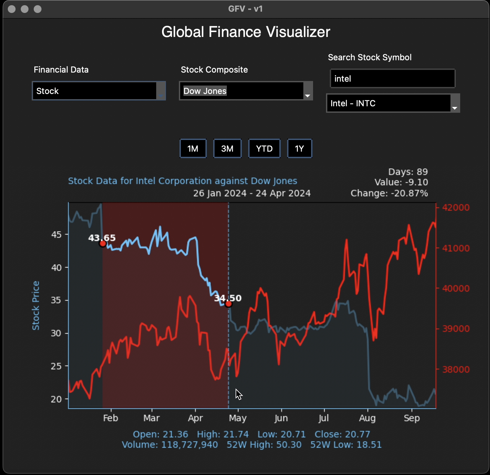
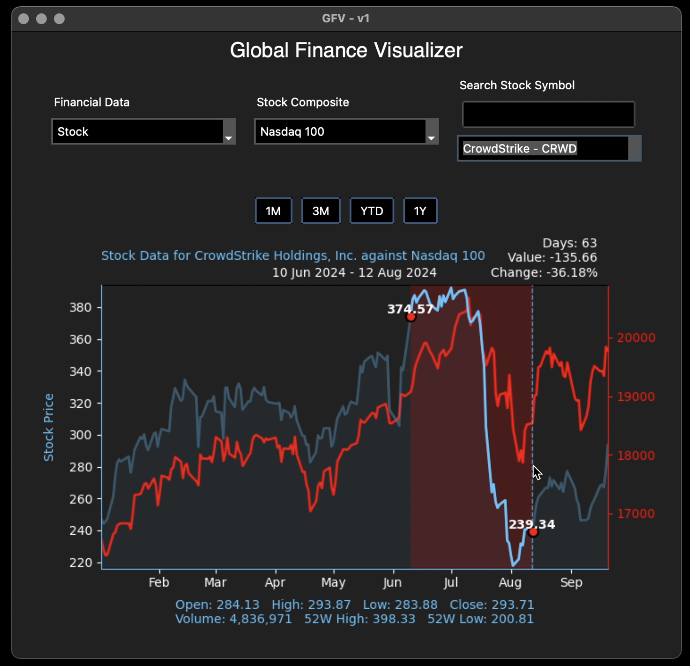
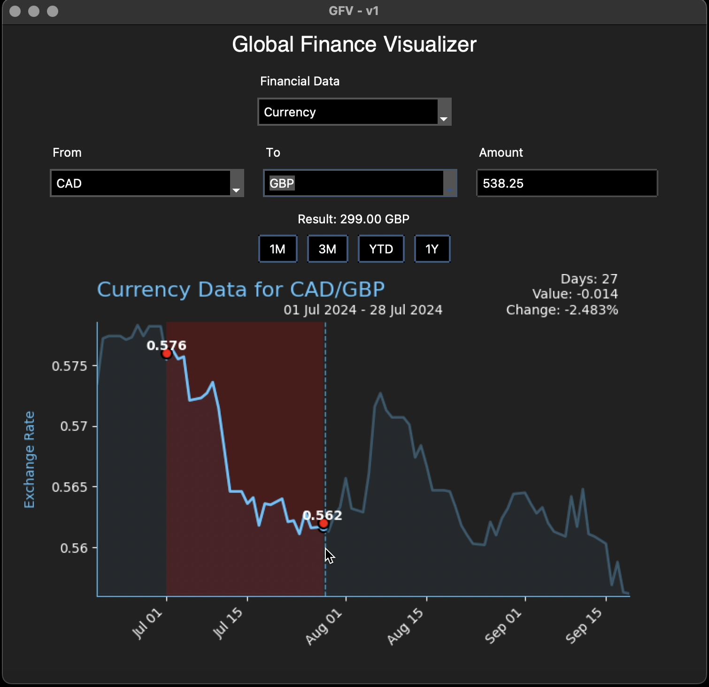
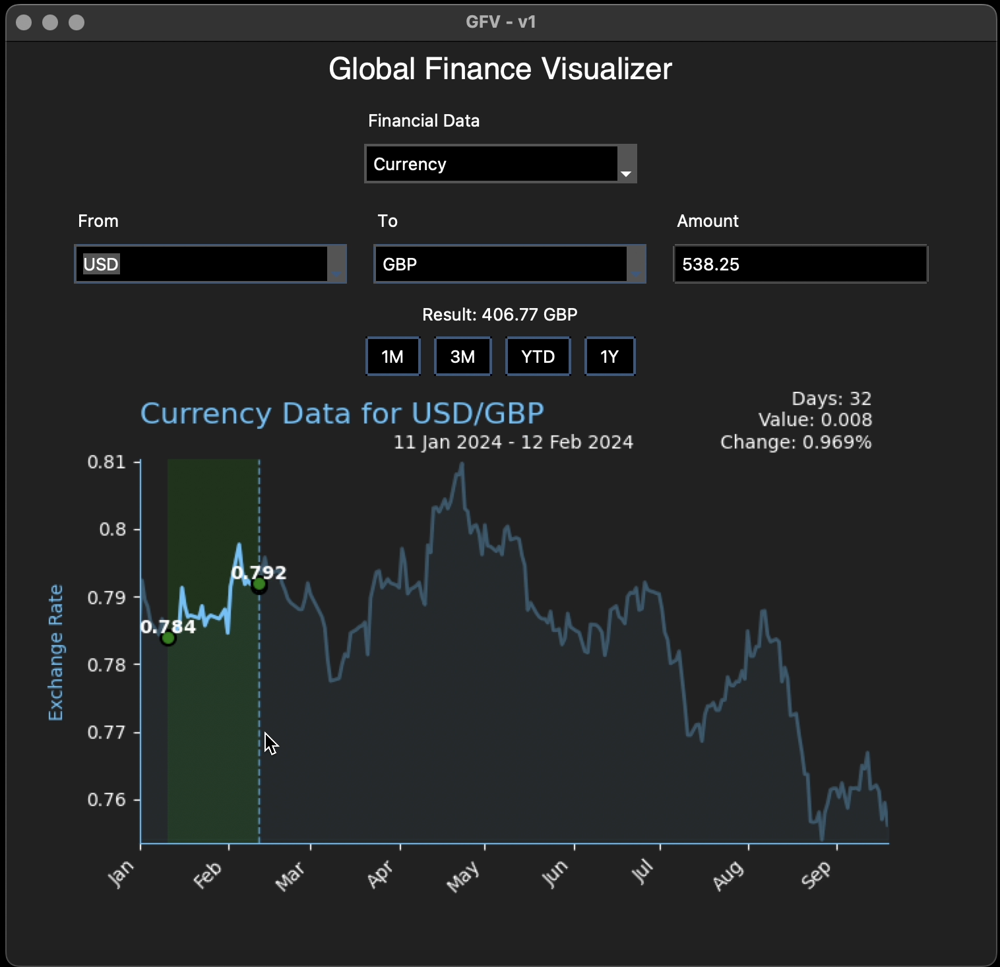
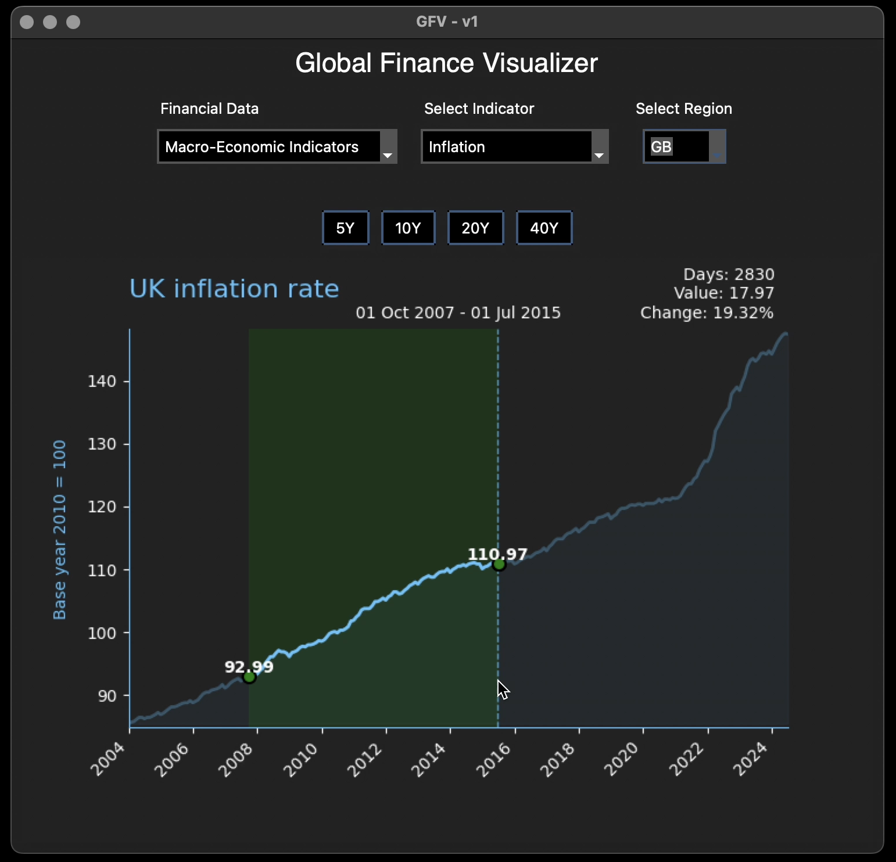
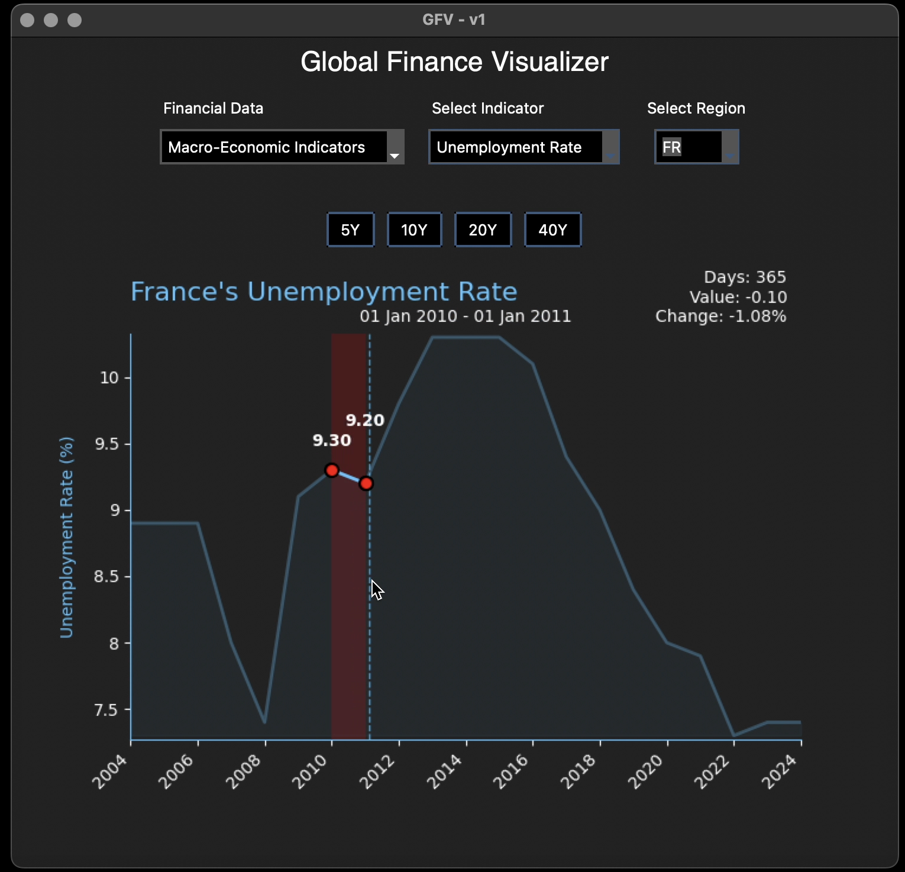

# Global Finance Visualizer

<!-- 
[](https://GitHub.com/psyss24/global-finance-visualizer/releases/) -->

> Built in Python + C

Global Finance Visualizer is an interactive application that charts and analyzes various financial data including currency exchange rates, stock prices, and macroeconomic indicators. It provides a user-friendly interface for visualizing complex financial data, making it easier for users to understand global economic trends.

[Demo Videos](media/demo_vid) · [Report Bug](https://github.com/psyss24/Global-Finance-Visualiser/issues)

 <!-- · [Request Feature](https://github.com/psyss24/Global-Finance-Visualiser/issues) -->

## 📋 Table of Contents

- [About The Project](#about-the-project)
  - [Built With](#built-with)
- [Features](#features)
- [Getting Started](#getting-started)
  - [Requirements](#requirements)
  - [Installation](#installation)
- [Usage](#usage)
- [Screenshots](#screenshots)
- [Acknowledgements](#acknowledgements)

##  About The Project


GFV is a streamlined tool designed to make it easier to explore and understand financial data. It provides an  interactive way to visualize key economic indicators, currency movements, and stock trends. The tool provides a simple, user-friendly interface to make it effortless to visualize the bigger picture without the complexity of traditional financial platforms.


### Built With

* [Tkinter](https://docs.python.org/3/library/tkinter.html)
* [Matplotlib](https://matplotlib.org/)
* [cJSON](https://github.com/DaveGamble/cJSON)

##  Features

- **Currency Data**: Visualize and compare exchange rates between different currencies.
- **Stock Data**: Chart stock prices for specific composites and compare them against market indices. Composites include:
  - S&P 500
  - DAX
  - Dow Jones
  - NASDAQ 100
  - FTSE 100

- **Macroeconomic Indicators**: Analyze various economic data including:
  - Inflation rates
  - Interest rates
  - GDP metrics
  - Government finance data (expenditure, revenue, debt)
  - Unemployment rates
- **Interactive Charting**:
  - Hover over data points to view specific values
  - Click and drag to compare two different time periods


##  Getting Started

To get a local copy up and running, follow these simple steps.
- GCC or Clang compiler
### Requirements
- GCC or Clang compiler
- Python
- Pip
- API Keys
- Libraries [see below](#install-libraries)

### Installation

1. Claim free API Keys at [EODHD](https://eodhd.com), [YHfinance](https://financeapi.net/home) and [FRED](https://fred.stlouisfed.org/docs/api/api_key.html)
2. Clone the repo
   ```sh
   git clone https://github.com/psyss24/global-finance-visualizer.git
   ```
3. Install Python packages
   ```sh
   pip install -r requirements.txt
   ```
4. <a id="install-libraries"></a>Install Libraries (for C backend):
    - **MacOS**:
    ```zsh
    brew install curl
    brew install cjson
    brew install libxml2
   ```
    - **Linux**:
    ```zsh
    sudo apt install libcurl4-openssl-dev
    brew install cjson
    sudo apt install libxml2-dev
   ```
   - **Windows**:
      - **vcpkg**:
        
        ```bash
          git clone https://github.com/microsoft/vcpkg.git
          cd vcpkg
          .\bootstrap-vcpkg.bat
          .\vcpkg install curl
          ```
        ```bash
          .\vcpkg install cjson
          ```
        ```bash
          .\vcpkg install libxml2
          ```
      <details>
        <summary>source</summary>     

        - [curl.se](https://curl.se/windows/)

        - [cJSON GitHub](https://github.com/DaveGamble/cJSON)

        - [xmlsoft.org](http://xmlsoft.org/download.html)
      </details>


5. Enter your API keys in `config.h`
   ```c
   #define EODHD_API_KEY 'ENTER YOUR API KEY'
   #define FRED_API_KEY 'ENTER YOUR API KEY'
   #define YFAPI_API_KEY 'ENTER YOUR API KEY'
   ```

##  Usage

1. After entering in the required API Keys and installing required libraries, simply run the main script:
   ```sh
   python main.py
   ```
    <details>
      <summary>note:</summary>
      <small>the C backend, compiled as a shared library -  can be recompiled via GCC:</small>
      
      ```gcc -fPIC -shared -o backend_library.so backend.c -lcurl -lcjson -lxml2 -lm```
<small>the compiled library is already included in the repository.</small>


</details>
2. Use the dropdown menus to select the type of data you want to visualize (Currency, Stock, or Macroeconomic Indicators).

3. Choose specific parameters (e.g., currency pairs, stock symbols, or economic indicators).
4. Select the desired time range using the buttons provided.
5. Interact with the chart by hovering over data points or clicking and dragging to compare different time periods.


## Screenshots

<div style="text-align: center;">
  <h4>Analyze Stock Trends</h4>
</div>

<table>
  <tr>
    <td><a href="media/demo_img/stock1.png" target="_blank"></a></td>
    <td><a href="media/demo_img/stock2.png" target="_blank"></a></td>
  </tr>
</table>

<div style="text-align: center;">
  <h4>Visualize Currency Fluctuations</h4>
</div>

<table>
  <tr>
    <td><a href="media/demo_img/currency1.png" target="_blank"></a></td>
    <td><a href="media/demo_img/currency2.png" target="_blank"></a></td>
  </tr>
</table>

<div style="text-align: center;">
  <h4>View Macro Indicators</h4>
</div>

<table>
  <tr>
    <td><a href="media/demo_img/macro1.png" target="_blank"></a></td>
    <td><a href="media/demo_img/macro2.png" target="_blank"></a></td>
  </tr>
</table>


## Acknowledgements
* [YHfinance](https://financeapi.net/home) for realtume currency values.
* [EODHD](https://eodhd.com) for stock market and historical currency data.
* [Federal Reserve Economic Data (FRED)](https://fred.stlouisfed.org/docs/api/api_key.html) and [International Monetary Fund (IMF) Data Mapper](https://www.imf.org/external/datamapper) for macro trends.
<!-- * [GitHub Pages](https://pages.github.com) -->

